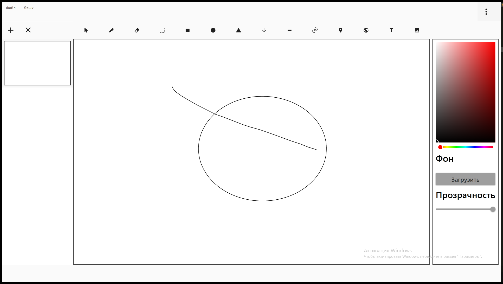

# Описание

Azbooka Editor - это редактор презентаций, работающий как отдельное приложение.

## Цель

Подготовить презентацию, а затем применить ее в интерактивных студиях видеозаписи iDesk Studio.

## Устройство презентации

Презентация состоит из слайдов, на которых расположенны различные элементы.

Элементы презентации являются интерактивными, их характеристики могут менять в реальном времени (такие как размер, расположение, цвет)

# Текущее устройство приложения

Приложение имеет один экран, на котором распологаются все элементы взаимодействия.

## Функционал

### Выпадающие меню

- Открывать и сохранять файлы Azooka Editor с компьютера пользователя.
- Импортировать файлы PDF (без возможности их редактирования) с компьютера пользователя.

- Изменение языка.

### Слайды

- Добавить слайд (по одному)
- Удалить **все** слайды.
- Перемещение по слайдам, если их больше чем можно отобразить, появляется элемент прокрутки (работает только по клику).

Все элементы можно добавить только на текущий выбранный слад, путем выбора инструмента и кликом по рабочей области (слайду).

Элементы появляются относительно клика по рабочей области (слайду).

### Инструменты рисования

Можно задавать цвет и прозрачность на основе текущих выбранных параметров.

#### Карандаш

Позволяет рисовать любые кривые. Кривая рисуется до тех пор, пока не отпущено рисование (например, пока не поднята левая кнопкой мыши).

#### Ластик

Удаляет элементы риования (карандаш и фигуры).

#### Выделение

Позволяет выделить любой обьект на слайде, после чего обьект доступен для трансформации с двух плоскостях (x, y, -x, -y) и перемещения.

#### Фигуры

Элементы фигру: Квадрат, Круг, Треугольник (Тупой), Стрела, Линия.

Имеют фиксированную точку начала отрисовки

### Загрузка фона

Позволяет загрузить изображение, которое будет применено на текущий выбранный слайд.

### 3D график

Сам график отображается на слайде, а параметры задаются в боковом меню. Можно изменять его прозрачность.

#### Параметры

- Функция
- Левый X, Y.
- Правый X, Y.

Каждый из параметров вводится в своем поле ввода, и имеет собственные?связанные? ограничения.

### Карты

Отображается карта на основе запроса географической точки (например: координаты, адрес, страна).

Запрос вводится в строке поиска расположенной над картой. Строка поиска и карты являются цельным элементом.

### Бразуер

Отображается web-страница на основе поискового запроса (адрес сайта?), по умолчанию идет поисковик.

Запрос вводится в строке поиска расположенной над браузером. Строка поиска и бразуер являются цельным элементом.

Имеются кнопки: Назад-Вперед (История перемещения по страницам), Перезагрузить.

### Блокнот 

Текст отображается только на самом блокноте, т.е не выходит за его рамки.

Свойства текста задаются в боковом меню, в зависимости от выделенного элемента строки.

#### Свойства

##### Начертание
- Обычный (по умолчанию)
- Жирное
- Курсив
- Подчертнутый

Могут пременяться все свойства сразу.

##### Выравнивание
- По правому краю
- По центру
- По левому краю

##### Шрифт

Берутся шрифты установленные на текущем устройстве (не храняться в файле презентации, т.е непереносимы).

При нажатии отобраажется выпадаюищй список со списком шрифтов, которые идут только как имя. Без демонтрации.

##### Размер шрифта

Выпадающий список из предустановленных размеров, предстовляющих собой таблицу кеглей.

### Изображение

При добавлении на слайд, появляется стандартное изображение.

В боковом меню можно заменить на свое и изменить прозрачность.

## UI

### При загрузке приложения

### Добавленым слайдом

### Элементы рисования

### 3D График

### Карта

### Редактор текста

### Изображение

